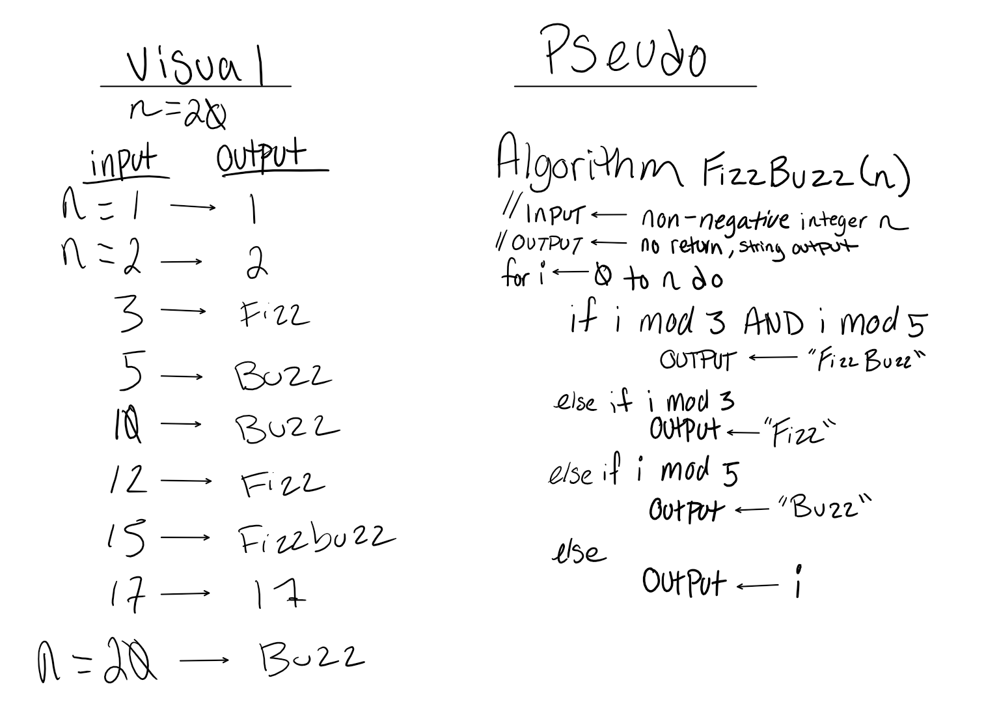

# FizzBuzz

## Challenge
FizzBuzz is a method that takes in an integer and iterates sequencially up to the given number.
 - Output "Fizz" if the number is divisible by 3.
 - Output "Buzz" if the number is divisible by 5. 
 - Output "FizzBuzz" if the number is divisible by both 3 and 5. 
 - Output the number itself if it is not divisble by either 3 or 5.

## Solution
